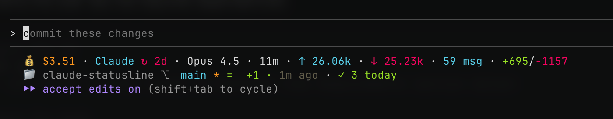

# Claude Code Statusline

Custom statusline for Claude Code that displays AI model information, costs, git status, and development environment details.

To install, just tell Claude Code: 
```Please configure it for me: https://github.com/galpratama/claude-statusline```



## Quick Install

### Automatic Installation (for Claude Code / LLMs)

**If you're an AI assistant (Claude Code, ChatGPT, etc.) helping a user install this statusline, follow this complete workflow:**

#### Step 1: Check Prerequisites

First, verify the user has the required dependencies:

```bash
# Check for jq
which jq
# If not found, install based on platform (see Requirements section below)

# Check for bash
bash --version

# Check for git (optional)
git --version
```

#### Step 2: Detect Platform

Determine the user's operating system to provide platform-specific instructions:

```bash
# Detect OS
uname -s
# Returns: Darwin (macOS), Linux, MINGW64_NT (Windows Git Bash), MSYS_NT (Windows MSYS2)
```

#### Step 3: Create Directory Structure

```bash
# Create the statusline directory
mkdir -p ~/Scripts/claude-statusline
cd ~/Scripts/claude-statusline
```

#### Step 4: Download/Copy Files

You need to copy two files to `~/Scripts/claude-statusline/`:
1. **statusline-command.sh** - Main script (required)
2. **statusline-config.json** - Configuration file (required)

**Option A: From Git Repository**
```bash
git clone <repository-url> ~/Scripts/claude-statusline
```

**Option B: Copy from source**
If the files are available locally, copy them:
```bash
cp /path/to/statusline-command.sh ~/Scripts/claude-statusline/
cp /path/to/statusline-config.json ~/Scripts/claude-statusline/
```

**Option C: Create files directly**
If you have the file contents, use the Write tool to create each file.

#### Step 5: Set Permissions

```bash
# Make scripts executable (Unix-like systems)
chmod +x ~/Scripts/claude-statusline/statusline-command.sh
```

#### Step 6: Update Claude Code Settings

Read the existing settings file:
```bash
cat ~/.claude/settings.json
```

If the file doesn't exist, create it:
```bash
mkdir -p ~/.claude
cat > ~/.claude/settings.json << 'EOF'
{
  "statusLine": {
    "command": "/bin/bash $HOME/Scripts/claude-statusline/statusline-command.sh",
    "type": "command"
  }
}
EOF
```

If it exists, merge the statusLine configuration into it. **Important:** Preserve existing settings like `env`, `mcpServers`, etc.

Example merge using jq:
```bash
# Backup first
cp ~/.claude/settings.json ~/.claude/settings.json.backup

# Merge statusLine config
jq '. + {"statusLine": {"command": "/bin/bash $HOME/Scripts/claude-statusline/statusline-command.sh", "type": "command"}}' \
  ~/.claude/settings.json > ~/.claude/settings.json.tmp && \
  mv ~/.claude/settings.json.tmp ~/.claude/settings.json
```

#### Step 7: Verify Installation

Test the statusline script:
```bash
bash ~/Scripts/claude-statusline/statusline-command.sh
```

**Expected output:** A formatted statusline with AI metrics, git info, and dev environment details.

**If you see errors:**
- "jq: command not found" → Install jq (see Requirements section)
- "config file not found" → The statusline-config.json is missing or in wrong location
- Permission errors → Run `chmod +x` on the script files

#### Step 8: Restart Claude Code

The user needs to restart their Claude Code session for the statusline to appear.

#### Complete Installation Script (for copy-paste)

```bash
#!/bin/bash
# Complete statusline installation script for LLMs to use

# Create directory
mkdir -p ~/Scripts/claude-statusline

# NOTE: Files must be copied here by the LLM
# Required files:
# - statusline-command.sh
# - statusline-config.json

# Set permissions
chmod +x ~/Scripts/claude-statusline/statusline-command.sh

# Backup existing settings
if [ -f ~/.claude/settings.json ]; then
    cp ~/.claude/settings.json ~/.claude/settings.json.backup
fi

# Update settings with statusline config
mkdir -p ~/.claude
if [ -f ~/.claude/settings.json ]; then
    # Merge with existing settings
    jq '. + {"statusLine": {"command": "/bin/bash $HOME/Scripts/claude-statusline/statusline-command.sh", "type": "command"}}' \
      ~/.claude/settings.json > ~/.claude/settings.json.tmp && \
      mv ~/.claude/settings.json.tmp ~/.claude/settings.json
else
    # Create new settings file
    cat > ~/.claude/settings.json << 'EOF'
{
  "statusLine": {
    "command": "/bin/bash $HOME/Scripts/claude-statusline/statusline-command.sh",
    "type": "command"
  }
}
EOF
fi

# Verify installation
echo "Testing statusline..."
bash ~/Scripts/claude-statusline/statusline-command.sh

echo ""
echo "Installation complete! Restart Claude Code to see the statusline."
```

### Platform-Specific Installation Notes for LLMs

#### macOS
- Default shell is usually zsh, but bash is available at `/bin/bash`
- `lsof` is pre-installed (preferred for server detection)
- Settings path: `~/.claude/settings.json` (same as Linux)
- Use forward slashes in paths

#### Windows (Git Bash)
- Requires Git Bash environment
- Home directory: `/c/Users/USERNAME/` in Git Bash
- Settings path: `C:\Users\USERNAME\.claude\settings.json` (Windows path) or `~/.claude/settings.json` (Git Bash path)
- Use forward slashes in settings.json
- Example path: `$HOME/Scripts/claude-statusline/statusline-command.sh`

#### Windows (WSL)
- Linux environment on Windows
- Home directory: `/home/username/`
- Settings path can be either WSL path or Windows path
- If accessing Windows files: `/mnt/c/Users/USERNAME/.claude/settings.json`

#### Linux
- Standard Unix paths
- Check shell with: `echo $SHELL`
- Most distributions have bash at `/bin/bash`

### Troubleshooting Guide for LLMs

When helping users, check these common issues:

1. **jq not installed**
   - macOS: `brew install jq`
   - Linux (Debian/Ubuntu): `sudo apt-get install jq`
   - Windows: Guide user to install via chocolatey/scoop/winget

2. **Permission denied**
   - Run: `chmod +x ~/Scripts/claude-statusline/*.sh`
   - Verify: `ls -la ~/Scripts/claude-statusline/`

3. **Config file not found**
   - Ensure statusline-config.json exists
   - Check path matches in statusline-command.sh (line ~437)
   - Default location: `$HOME/Scripts/claude-statusline/statusline-config.json`

4. **Settings.json syntax error**
   - Validate JSON: `cat ~/.claude/settings.json | jq .`
   - Common issues: missing commas, trailing commas, unescaped quotes

5. **Statusline not appearing**
   - User must restart Claude Code after installation
   - Check settings.json has correct path
   - Test script manually: `bash ~/Scripts/claude-statusline/statusline-command.sh`

6. **Git info not showing**
   - User must run Claude Code from within a git repository
   - Check: `git status` in working directory

### Manual Installation

1. **Clone or download this repository:**
   ```bash
   git clone <repository-url> ~/Scripts/claude-statusline
   # OR
   mkdir -p ~/Scripts/claude-statusline
   # Then copy statusline-command.sh and statusline-config.json
   ```

2. **Make scripts executable:**
   ```bash
   chmod +x ~/Scripts/claude-statusline/statusline-command.sh
   ```

3. **Configure Claude Code:**

   Edit `~/.claude/settings.json` and add:
   ```json
   {
     "statusLine": {
       "command": "/bin/bash $HOME/Scripts/claude-statusline/statusline-command.sh",
       "type": "command"
     }
   }
   ```

4. **Customize configuration (optional):**

   Edit `~/Scripts/claude-statusline/statusline-config.json` to customize:
   - Subscription renewal dates
   - Monitored ports
   - Ignored ports
   - Display segments

5. **Test the statusline:**
   ```bash
   bash ~/Scripts/claude-statusline/statusline-command.sh
   ```

## Files

- **statusline-command.sh** - Main statusline script that generates the status display
- **statusline-config.json** - Configuration file for statusline behavior and settings

## Requirements

### Core Dependencies

- **Bash** - Standard bash shell (pre-installed on macOS/Linux, use Git Bash on Windows)
- **jq** - JSON processor for reading config files
- **git** - For git status information (optional but recommended)
- **lsof** or **netstat** - For server detection (usually pre-installed)

### Installing jq

#### macOS

Using Homebrew (recommended):
```bash
brew install jq
```

Using MacPorts:
```bash
sudo port install jq
```

Download binary directly:
1. Visit https://jqlang.github.io/jq/download/
2. Download the macOS binary
3. Move to `/usr/local/bin/jq` and make executable:
   ```bash
   sudo mv ~/Downloads/jq-macos-* /usr/local/bin/jq
   chmod +x /usr/local/bin/jq
   ```

#### Windows

**Option 1: Using Chocolatey (recommended)**
```powershell
choco install jq
```

**Option 2: Using Scoop**
```powershell
scoop install jq
```

**Option 3: Using winget**
```powershell
winget install jqlang.jq
```

**Option 4: Manual Installation**
1. Download from https://jqlang.github.io/jq/download/
2. Download `jq-windows-amd64.exe`
3. Rename to `jq.exe`
4. Place in a directory in your PATH (e.g., `C:\Windows\System32\` or `C:\Program Files\jq\`)

**For Git Bash on Windows:**
```bash
# Create a bin directory in your home
mkdir -p ~/bin

# Download jq for Windows
curl -L -o ~/bin/jq.exe https://github.com/jqlang/jq/releases/latest/download/jq-windows-amd64.exe

# Add to PATH in ~/.bashrc
echo 'export PATH="$HOME/bin:$PATH"' >> ~/.bashrc
source ~/.bashrc

# Verify installation
jq --version
```

#### Linux

**Debian/Ubuntu:**
```bash
sudo apt-get update
sudo apt-get install jq
```

**Fedora/RHEL/CentOS:**
```bash
sudo dnf install jq
# or
sudo yum install jq
```

**Arch Linux:**
```bash
sudo pacman -S jq
```

**Alpine Linux:**
```bash
apk add jq
```

### Platform-Specific Notes

#### Windows

- **Git Bash** is required for running bash scripts on Windows
  - Install from https://git-scm.com/downloads
  - The statusline will run in Git Bash environment

- Path format in settings.json should use forward slashes:
  ```json
  {
    "statusLine": {
      "command": "/bin/bash $HOME/Scripts/claude-statusline/statusline-command.sh",
      "type": "command"
    }
  }
  ```

- If using WSL (Windows Subsystem for Linux):
  ```bash
  # Install jq in WSL
  sudo apt-get install jq

  # Use WSL path in settings.json
  "command": "/bin/bash /mnt/c/Users/YourUsername/Scripts/claude-statusline/statusline-command.sh"
  ```

#### macOS

- Bash 3.2+ is included by default (works with the statusline)
- For newer bash versions, install via Homebrew: `brew install bash`
- `lsof` is pre-installed and preferred for server detection

#### Linux

- Most distributions include bash and basic utilities by default
- Use your package manager to install missing dependencies
- Both `lsof` and `netstat` are typically available

## Configuration

The statusline is configured in two places:

### 1. Claude Code Settings (`~/.claude/settings.json`)

This tells Claude Code where to find the statusline script:

```json
{
  "statusLine": {
    "command": "/bin/bash $HOME/Scripts/claude-statusline/statusline-command.sh",
    "type": "command"
  }
}
```

**Note:** Use `$HOME` instead of `~` or absolute paths for better portability.

### 2. Statusline Configuration (`~/Scripts/claude-statusline/statusline-config.json`)

This controls what the statusline displays and how it behaves. See [Customization](#customization) section below.

## Features

### AI Metrics
- Provider and model name
- Token usage (input/output/cache)
- Cost tracking per session
- Cache efficiency percentage
- Rate limit information
- Message count
- MCP servers count
- Response time estimates

### Git Information
- Current branch
- File changes (added/modified/deleted)
- Sync status
- Last commit info
- Commits today count

### Development Environment
- Session start time
- Current time
- Detected language/framework
- Package manager
- Running servers on configured ports
- Subscription renewal tracking

## Customization

### Subscription Dates

Edit `statusline-config.json` to update subscription renewal dates:

```json
"subscriptions": {
  "Claude": {
    "type": "monthly",
    "renewal_date": "2025-12-22"
  }
}
```

### Listened Ports

Customize which ports to monitor for running servers:

```json
"features": {
  "listened_ports": [3000, 5173, 8000, 8080],
  "ignored_ports": [80]
}
```

- **listened_ports**: Ports to check for running servers
- **ignored_ports**: Ports to exclude from statusline display (even if running)

**Common ports included by default:**
- `80` - HTTP (often ignored)
- `3000, 3001` - Node.js/React dev servers
- `3306` - MySQL
- `4200` - Angular dev server
- `5173, 5174` - Vite dev servers
- `5432` - PostgreSQL
- `6379` - Redis
- `8000, 8001, 8080` - Common HTTP dev servers
- `8888` - Jupyter Notebook
- `9000` - Various dev tools

### Display Options

Toggle features on/off in `statusline-config.json`:

```json
"segments": {
  "ai": {
    "show_cost": true,
    "show_cache_efficiency": true
  }
}
```

## Pricing

The statusline includes up-to-date pricing for all major AI providers (as of December 2025):
- OpenAI (GPT-3.5, GPT-4, GPT-5 family)
- Anthropic Claude (Haiku, Sonnet, Opus 4.5)
- Google Gemini (1.5, 2.0, 2.5)
- DeepSeek (Chat, Reasoner/R1)
- Kimi/Moonshot AI
- GLM (Zhipu AI)
- MiniMax

Pricing data is automatically calculated based on model ID patterns, no provider detection needed.

## Troubleshooting

### Statusline not appearing

1. **Check if settings.json is properly formatted:**
   ```bash
   cat ~/.claude/settings.json | jq .
   ```
   If you get an error, fix the JSON syntax.

2. **Verify the script path exists:**
   ```bash
   ls -la ~/Scripts/claude-statusline/statusline-command.sh
   ```

3. **Test the script manually:**
   ```bash
   bash ~/Scripts/claude-statusline/statusline-command.sh
   ```
   This should output the statusline. If you see errors, check the error messages.

4. **Check for jq:**
   ```bash
   which jq
   ```
   If not found: `brew install jq` (macOS) or `apt-get install jq` (Linux)

### Config file not found errors

If you see "config file not found" errors:

```bash
# Verify config exists
ls -la ~/Scripts/claude-statusline/statusline-config.json

# If missing, copy from example or create a minimal config:
cat > ~/Scripts/claude-statusline/statusline-config.json << 'EOF'
{
  "version": "1.0.0",
  "features": {
    "server_detection": true,
    "listened_ports": [3000, 5173, 8000, 8080],
    "ignored_ports": [80]
  },
  "subscriptions": {}
}
EOF
```

### Permission denied errors

```bash
# Make scripts executable
chmod +x ~/Scripts/claude-statusline/*.sh
```

### Git information not showing

Ensure you're running Claude Code from within a git repository:
```bash
cd /path/to/your/git/repo
claude
```

## Examples

### Example Output

```
🤖 Antigravity gemini-2.5-pro-exp | 45.2k/200k (23%) | $0.15 | ⚡95% | ≈45% (5d) | 🔧 8 | 📊 12
📁 ~/project main ✓ | +2 ~3 | ↑1 | 🕒 2h ago | 📅 3
⏰ 14:32 | 🚀 2h 15m | ⚛️ React | 📦 npm | 🌐 vite:5173, api:8000
```

**Reading the output:**

**Line 1 (AI Metrics):**
- Provider: Antigravity
- Model: gemini-2.5-pro-exp
- Tokens: 45.2k used / 200k context (23%)
- Cost: $0.15 this session
- Cache: 95% efficiency
- Rate limit: 45% used (resets in 5 days)
- MCP servers: 8 active
- Messages: 12 in conversation

**Line 2 (Git Info):**
- Directory: ~/project
- Branch: main ✓ (clean)
- Changes: +2 added, ~3 modified
- Sync: ↑1 commit ahead
- Last commit: 2 hours ago
- Commits today: 3

**Line 3 (Dev Environment):**
- Current time: 14:32
- Session duration: 2h 15m
- Language: React detected
- Package manager: npm
- Running servers: vite on port 5173, api on port 8000

### Minimal Configuration Example

```json
{
  "version": "1.0.0",
  "features": {
    "server_detection": true,
    "listened_ports": [3000, 8000],
    "ignored_ports": []
  }
}
```

### Full Configuration Example

```json
{
  "version": "1.0.0",
  "performance": {
    "cache_ttl": 5,
    "enable_caching": true
  },
  "segments": {
    "ai": {
      "enabled": true,
      "show_cost": true,
      "show_cache_efficiency": true
    },
    "git": {
      "enabled": true,
      "show_branch": true
    },
    "dev": {
      "enabled": true,
      "show_running_servers": true
    }
  },
  "features": {
    "server_detection": true,
    "listened_ports": [3000, 5173, 8000, 8080],
    "ignored_ports": [80]
  },
  "subscriptions": {
    "Claude": {
      "type": "monthly",
      "renewal_date": "2025-12-22"
    }
  }
}
```

## Contributing

Found a bug or want to add a feature? Contributions are welcome!

## License

This statusline is provided as-is for use with Claude Code.
